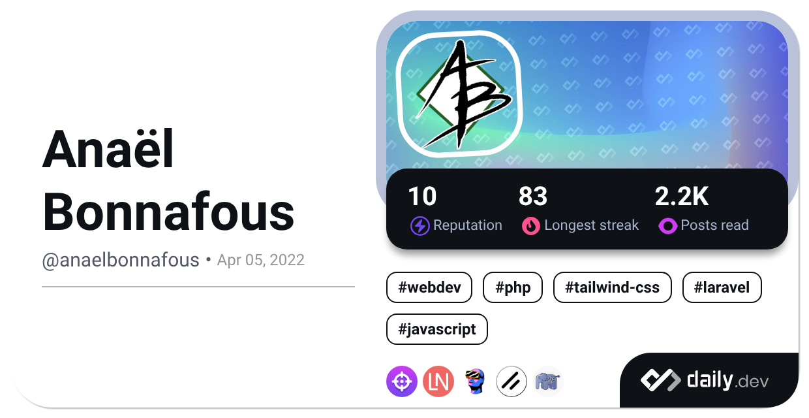

# Bien le bonjour ! 

**Je m'appelle Anaël Bonnafous** - Développeur web passionné et intéressé par les aspects frontend, backend et mobile du métier. Je me forme très largement en autodidacte sur des technologies nouvelles et j'adore échanger à ce sujet avec d'autres développeurs. Je travaille en ce moment sur différents projets personnels et commence à m'initier à la contribution à l'open source.

[;+sleep(%F0%9F%9B%8F%EF%B8%8F);+code(%F0%9F%92%BB);+repeat(%F0%9F%94%81);)](https://git.io/typing-svg)

## 🔎 Informations

- 🎓 Actuellement étudiant à **Ynov Lyon** et en apprentissage chez **Netizis**

- 😍 Fan des frameworks de développement **Vue**💚 **Laravel**❤️ et **Ionic**💙

- 🌱 Explorant toujours de nouvelles technologies : **Astro**, **Livewire**, **Inertia**, etc...

- ⭐ Passionné par **le développement web**, **la photographie** et **l'urbex**

- 📫 N'hésitez pas à me contacter par [**mail**](mailto:anael.bonnafous@gmail.com) ou via [**mon site web**](https://anaelbonnafous.fr/)

## 📈 Statistiques

)
)
)
)
)

## 💡 Projets

